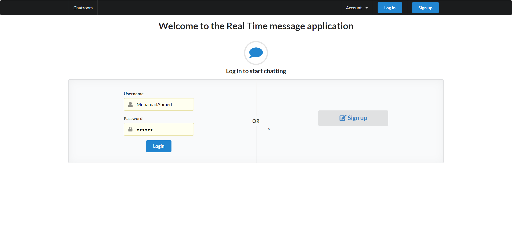
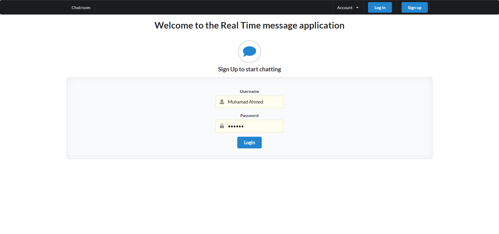
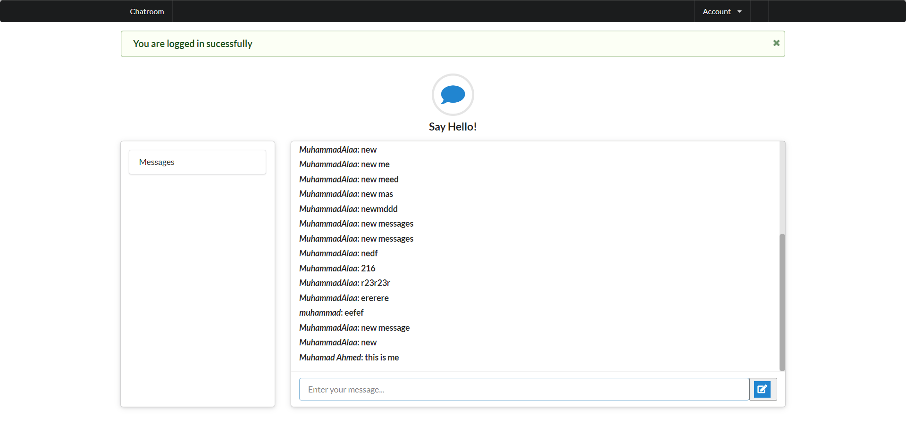

 
    

# Table of contents

- [Table of contents](#table-of-contents)
- [Description](#description)
- [📷 Screenshots](#-screenshots)
  - [🔑 User Management](#-user-management)
  - [🙍‍♂️ Users](#️-users)
- [Technologies](#technologies)
  - [Frontend](#frontend)
  - [Backend](#backend)
- [Contributers](#contributers)

# Description

Message-App is an app that has users that can sign in and sign up chat with each others in real time [Deployed App](https://alaa-blog-2021.herokuapp.com/).

# 📷 Screenshots

## 🔑 User Management

## 🙍‍♂️ Users

# Technologies

## Frontend

- Embedded ruby

## Backend

- Ruby on rails
- SQL

# Contributers

- [Muhammed Alaa](https://github.com/MuhammeedAlaa)
